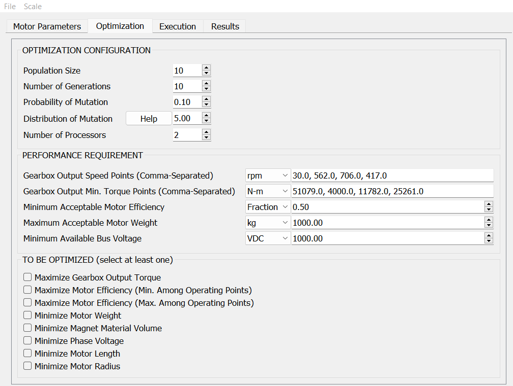
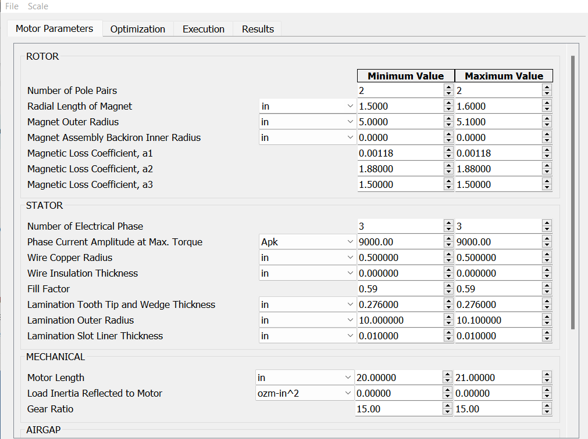
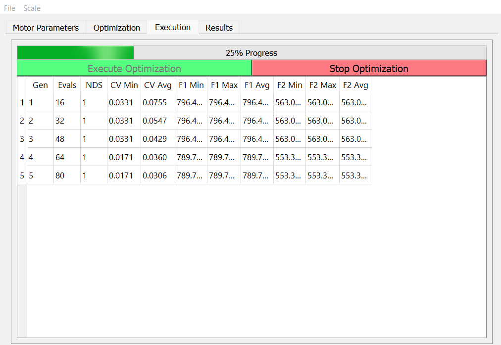

# Setup
I have created 2 simple .bat files you can run from command promt
* 1_setup.bat (this sets up a virtual environment for the program to run)
* 2_compile.bat (optional, compile the UI and assets)
* 3_run.bat (runs the GUI program)

# Compile Interface
The `gui/interface.py` is created from compiling the UI xml file `assets/BLDC.ui`. (This .ui can be editted using Qt designer)
1. To compile resources for the interface  `pyside2-rcc assets/resources.qrc -o gui/resources_rc.py`
2. To compile this the interface, run `pyside2-uic --from-imports assets/BLDC_ResFixed.ui -o gui/interface.py`

# GUI Usage
1. Enter Virtual Environment `source virt/bin/activate` or `"virt/Scripts/activate.bat"`
2. Run GUI `python run.py`. alternativly, run via notebook with `BLDC_Optimizer.ipynb`.

# UI Reworks
* BLDC1.ui (original interface, no scaling)
* BLDC2.ui (used `updater-grids.py` to rewrite UI to have dynamic grid layout, this shuffled some widget around though)
* BLDC3.ui (using QtDesigner, i manually updated the interface to shuffle the widgets back in order, I also added a Toolbar that lets you change the font size)
* BLDC4.ui (used `updater-scroll.py` to rewrite UI to have vertical scroll bars when the contents overflow the interface)
* BLDC_ResFixed.ui modern version, all fixes, branding, etc.

# Matlab Download
* [Official Download](https://www.mathworks.com/help/install/ug/install-products-with-internet-connection.html)
* [Linux Installer](https://github.com/marshki/matlab_installer)
* [Arch Installer](https://github.com/Rubo3/matlab-aur)
* [Windows Torrent](https://tinyurl.com/ynhcdh7r)